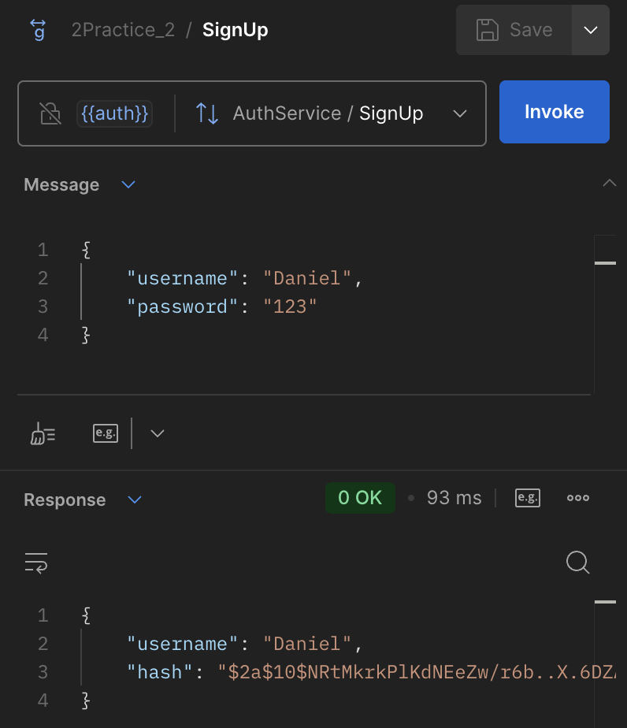
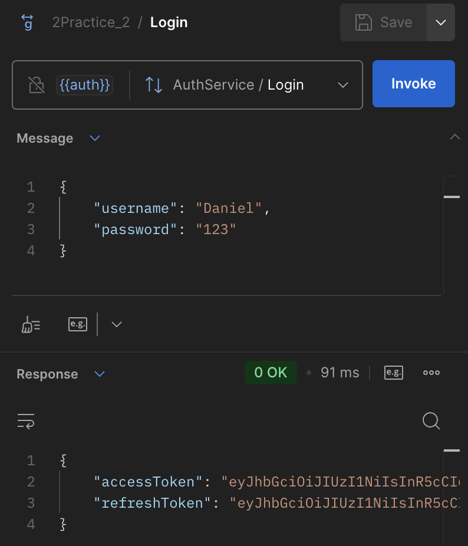
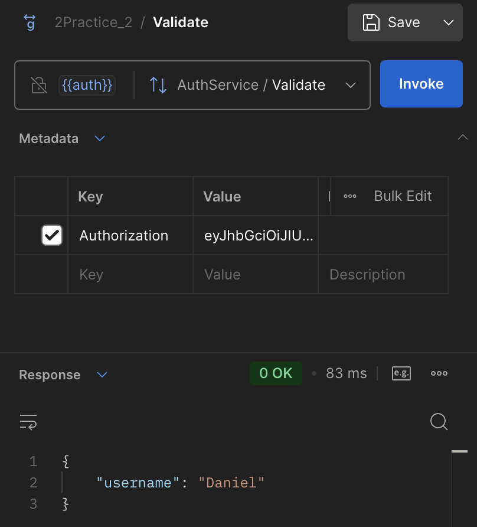
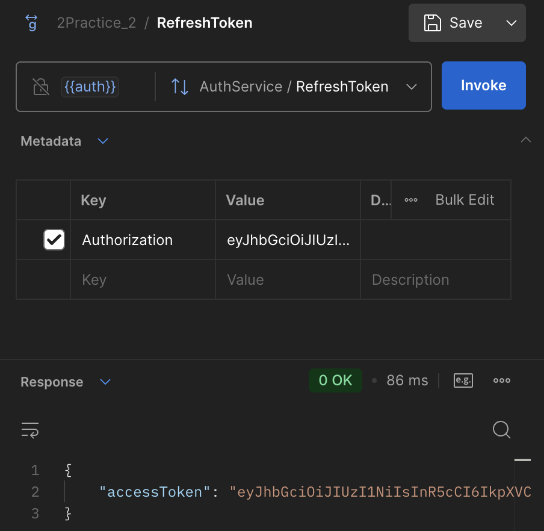
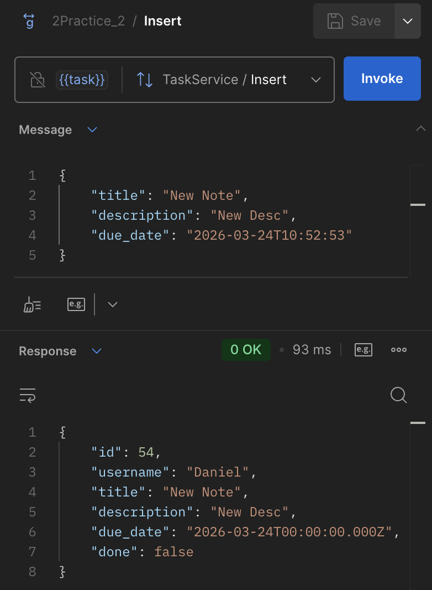
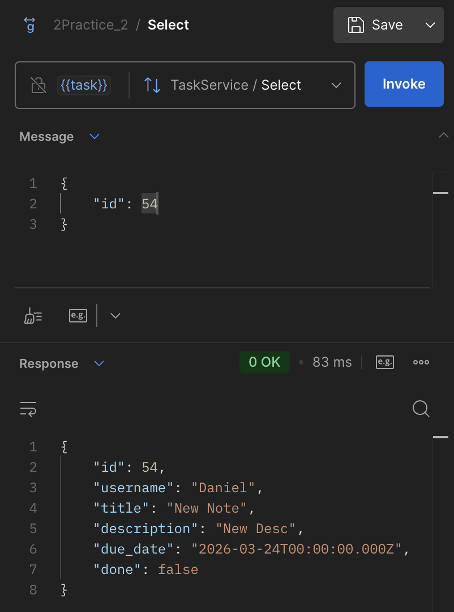
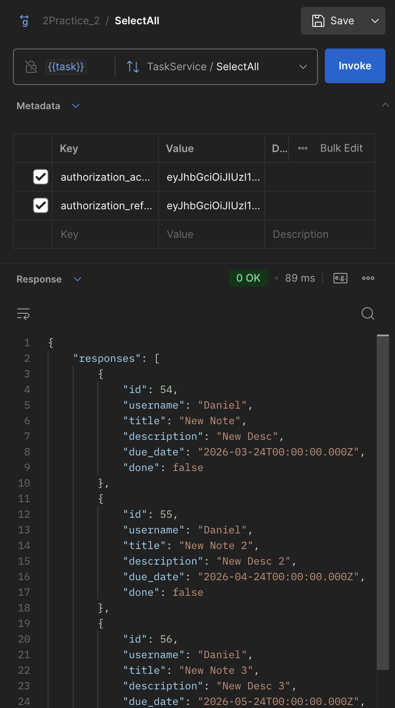
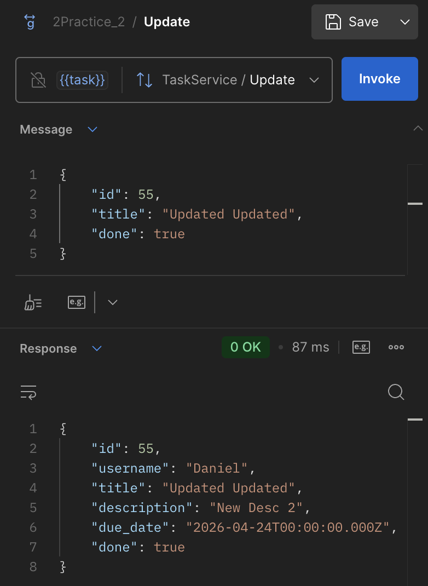
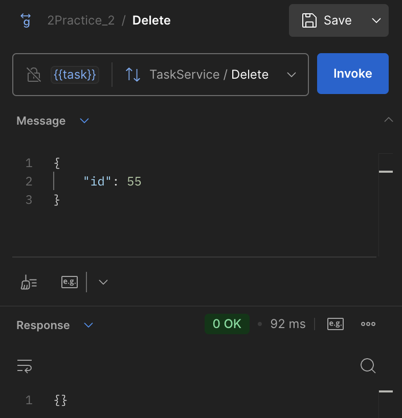
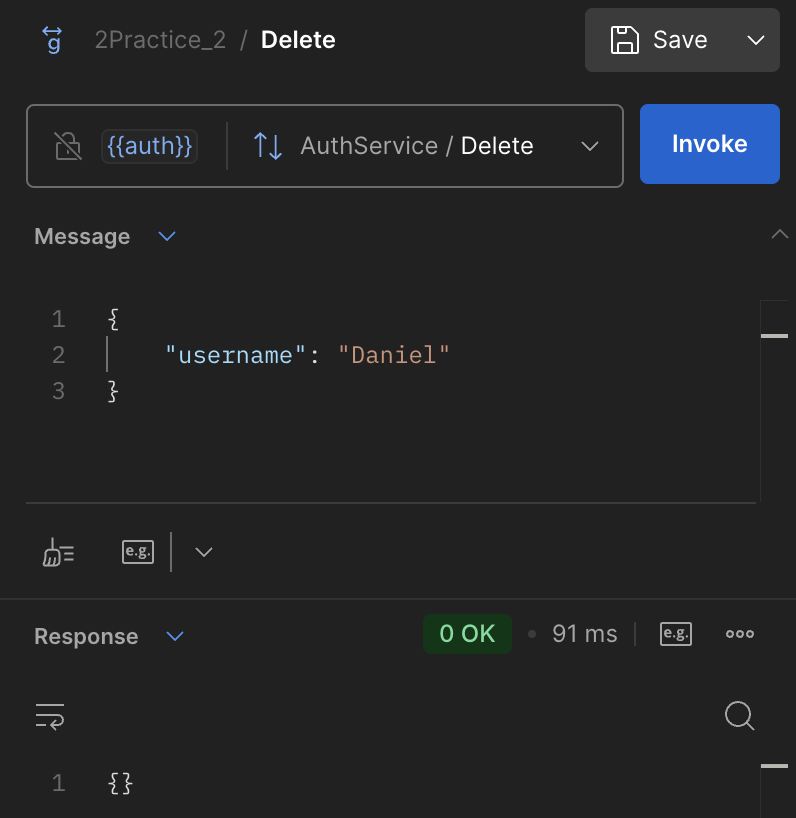

# Коляда Даниил
## Практическая работа №2

### Цель работы

Освоить разработку простого микросервиса на Go с использованием gRPC, включая описание контракта в формате Protocol Buffers, генерацию кода, запуск gRPC-сервера и выполнение клиентских вызовов методов

---

## Эндпоинты

### Auth Service

| Method | Request | Metadata | Response |
|-|-|-|-|
| **SignUp** | `AuthRequest` | | `SignUpResponse` |
| **Login** | `AuthRequest` | | `LoginResponse` |
| **Validate** | | `authorization: accesToken` | `ValidateResponse` |
| **RefreshToken** | | `authorization: refreshToken` | `RefreshResponse` |
| **Delete** | `DeleteRequest` | `authorization: accesToken` | |

---

#### Requests

```protobuf
message AuthRequest {
    string username = 1;
    string password = 2;
}

message DeleteRequest {
    string username = 1;
}
```

---

#### Responses

```protobuf
message SignUpResponse {
    string username = 1;
    string hash = 2;
}

message ValidateResponse {
    string username = 1;
}

message RefreshResponse {
    string accessToken = 1;
}

message LoginResponse {
    string accessToken = 1;
    string refreshToken = 2;
}
```

---

### Tasks Service

| Method | Request | Metadata | Response |
|-|-|-|-|
| **Insert** | `InsertRequest` | `authorization_access: accessToken`<br>`authorization_refresh: refreshToken` | `SelectResponse` |
| **Select** | `IdRequest` | `authorization_access: accessToken`<br>`authorization_refresh: refreshToken` | `SelectResponse` |
| **SelectAll** | | `authorization_access: accessToken`<br>`authorization_refresh: refreshToken` | `SelectAllResponse` |
| **Update** | `UpdateRequest` | `authorization_access: accessToken`<br>`authorization_refresh: refreshToken` | `SelectResponse` |
| **Delete** | `IdRequest` | `authorization_access: accessToken`<br>`authorization_refresh: refreshToken` | |

---

**Requests**

```protobuf
message InsertRequest {
    string title = 1;
    string description = 2;
    google.protobuf.Timestamp due_date = 3;
}

message IdRequest {
    int32 id = 1;
}

message UpdateRequest {
    int32 id = 1;
    optional string title = 2;
    optional string description = 3;
    optional google.protobuf.Timestamp due_date = 4;
    optional bool done = 5;
}
```

---

**Responses**

```protobuf
message SelectResponse {
    int32 id = 1;
    string username = 2;
    string title = 3;
    string description = 4;
    google.protobuf.Timestamp due_date = 5;
    bool done = 6;
}

message SelectAllResponse {
    repeated SelectResponse responses = 1;
}
```

---

### Тесты

|||
|-|-|
|||


||||
|-|-|-|
||||

---


### Выводы

Освоили разработку простого микросервиса на Go с использованием gRPC, включая описание контракта в формате Protocol Buffers, генерацию кода, запуск gRPC-сервера и выполнение клиентских вызовов методов

---

### Дерево проекта
```
├── README.md
├── auth
│   ├── cmd
│   │   └── main.go
│   ├── db
│   │   └── db.go
│   ├── handlers
│   │   └── handlers.go
│   ├── proto
│   │   ├── gen
│   │   │   ├── requests.pb.go
│   │   │   ├── responses.pb.go
│   │   │   ├── service.pb.go
│   │   │   └── service_grpc.pb.go
│   │   ├── requests.proto
│   │   ├── responses.proto
│   │   └── service.proto
│   └── utils
│       ├── env.go
│       ├── password.go
│       └── token.go
├── go.mod
├── go.sum
├── screenshots
│   ├── ...
└── task
    ├── auth
    │   └── auth.go
    ├── cmd
    │   └── main.go
    ├── db
    │   └── db.go
    ├── dtos
    │   ├── requests.go
    │   └── responses.go
    ├── handlers
    │   └── handlers.go
    ├── middleware
    │   └── middleware.go
    ├── proto
    │   ├── gen
    │   │   ├── task_requests.pb.go
    │   │   ├── task_responses.pb.go
    │   │   ├── task_service.pb.go
    │   │   └── task_service_grpc.pb.go
    │   ├── task_requests.proto
    │   ├── task_responses.proto
    │   └── task_service.proto
    └── utils
        └── utils.go

19 directories, 41 files
```