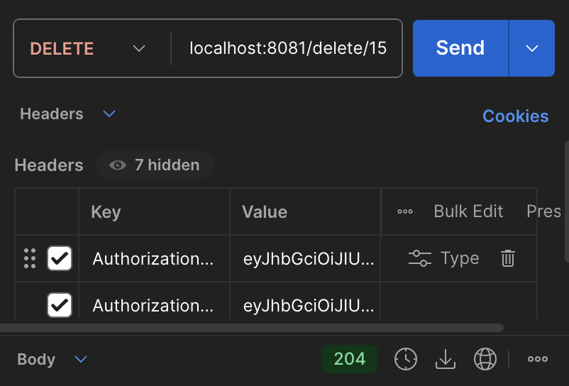
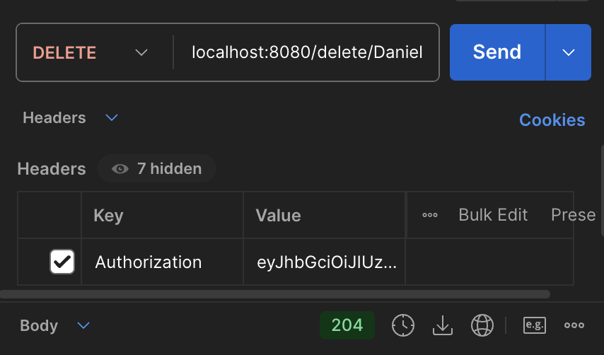
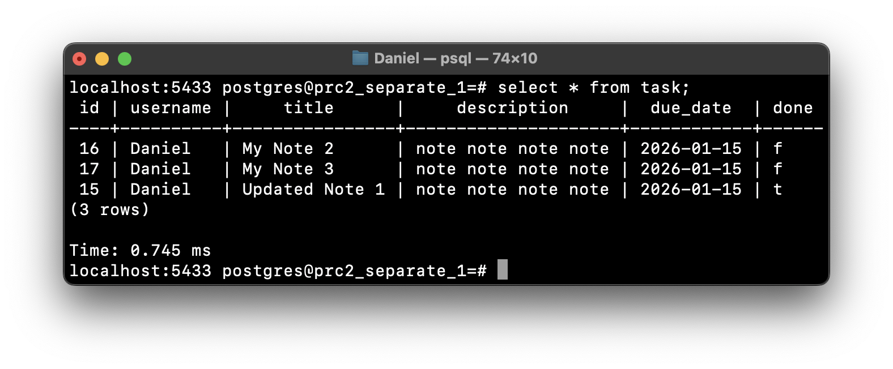
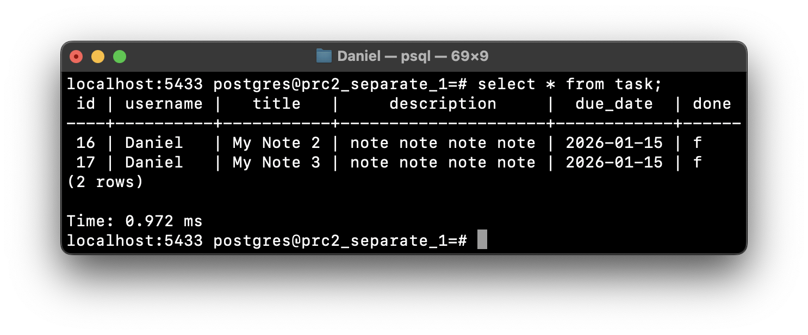
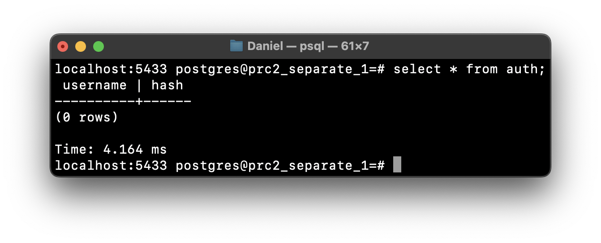

# Коляда Даниил
## Практическая работа №1

### Цель работы

Научиться декомпозировать небольшую систему на два сервиса и организовать корректное синхронное взаимодействие по HTTP

---

### Эндпоинты

Auth Service

| Тип | Адрес |
|-|-|
| POST | localhost:8080/signup |
| GET | localhost:8080/login  |
| DELETE | localhost:8080/delete/{username} |
| GET | localhost:8080/refreshtoken |
| GET | localhost:8080/validate |

---

Tasks Service

| Тип | Адрес |
|-|-|
| POST | localhost:8081/insert |
| GET | localhost:8081/selectall  |
| GET | localhost:8081/select/{id} |
| PATCH | localhost:8081/update/{id} |
| DELETE | localhost:8081/delete/{id} |

---

### Тесты

Тестирование эндпоинта localhost:8080/signup


---

Тестирование эндпоинтов

- localhost:8080/login
- localhost:8080/refreshtoken
- localhost:8080/validate

|||
|-|-|-|

---

Тестирование эндпоинта localhost:8081/insert


---

Тестирование эндпоинта localhost:8081/selectall


---

Тестирование эндпоинта localhost:8081/select/{id}


---

Тестирование эндпоинтов

- localhost:8081/update/{id}
- localhost:8081/delete/{id}
- localhost:8080/delete/{username}

||||
|-|-|-|
||||

### Выводы

Декомпозировали систему на два сервиса и организовали корректное синхронное взаимодействие по HTTP

---

### Дерево проекта
```
2prc_separation_1
├── README.md
├── auth
│   ├── cmd
│   │   └── main.go
│   ├── db
│   │   └── db.go
│   ├── dtos
│   │   └── dtos.go
│   ├── handlers
│   │   └── handlers.go
│   └── utils
│       ├── env.go
│       ├── password.go
│       └── token.go
├── go.mod
├── go.sum
├── screenshots
│   ├── ...
└── task
    ├── auth
    │   └── auth.go
    ├── cmd
    │   └── main.go
    ├── db
    │   ├── db.go
    │   └── db_test.go
    ├── dtos
    │   ├── requests.go
    │   └── responses.go
    ├── handlers
    │   └── handlers.go
    ├── middleware
    │   └── middleware.go
    └── utils
        └── utils.go

16 directories, 34 files
```