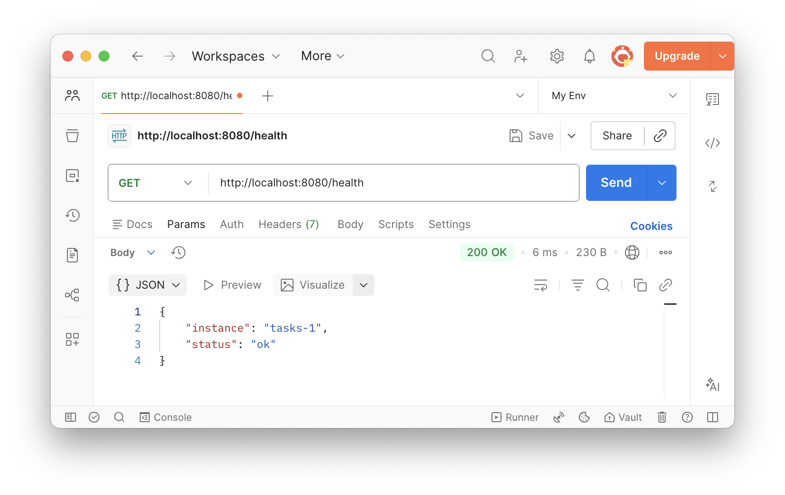
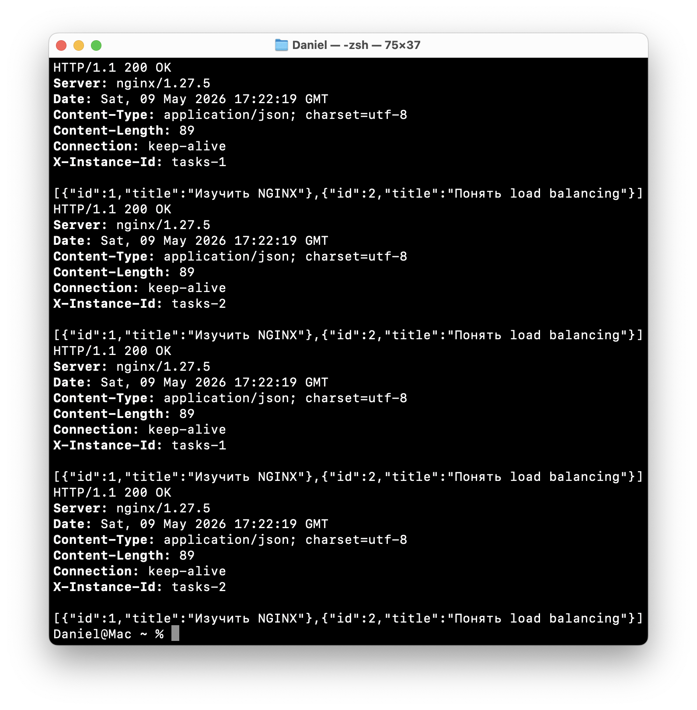
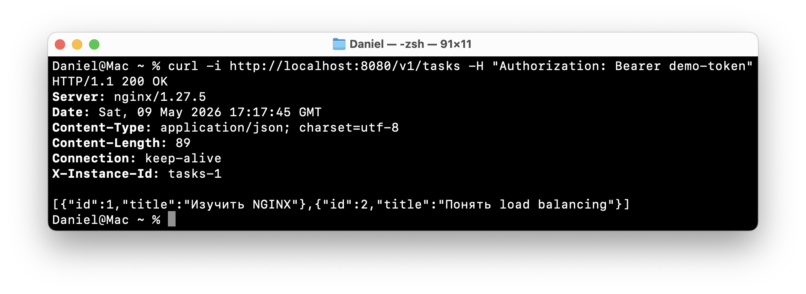

# Коляда Даниил
## Практическая работа №10

### Цель работы

Освоить базовый подход к горизонтальному масштабированию backend-приложения за счёт запуска нескольких экземпляров одного сервиса и распределения входящих HTTP-запросов через NGINX в роли балансировщика нагрузки

---

### Шаги

**Запуск стенда**  
Перешли в папку deploy/lb и выполнили

```
docker compose up -d --build
```

```
[+] Running 6/6
 ✔ lb-tasks_1          Built       0.0s
 ✔ lb-tasks_2          Built       0.0s
 ✔ Network lb_default  Created     0.0s
 ✔ Container tasks_2   Started     0.2s
 ✔ Container tasks_1   Started     0.2s
 ✔ Container nginx_lb  Started     0.2s
```

---

Проверили
```
docker compose ps
```

Результат
- tasks_1 работает
- tasks_2 работает
- nginx работает
- внешний доступ осуществляется через localhost:8080

```
NAME       IMAGE               COMMAND                  SERVICE   CREATED          STATUS          PORTS
nginx_lb   nginx:1.27-alpine   "/docker-entrypoint.…"   nginx     34 seconds ago   Up 33 seconds   0.0.0.0:8080->8080/tcp, [::]:8080->8080/tcp
tasks_1    lb-tasks_1          "/app/tasks"             tasks_1   34 seconds ago   Up 33 seconds   8082/tcp
tasks_2    lb-tasks_2          "/app/tasks"             tasks_2   34 seconds ago   Up 33 seconds   8082/tcp
```

---

**Проверка health endpoint**  
Выполнили

```
curl -i http://localhost:8080/health
```

Результат:
- статус 200 OK
- тело ответа с status: ok
- заголовок X-Instance-ID



---

**Проверка балансировки**  
Сделали несколько запросов подряд

Видим, что ответы распределяются между двумя репликами


---

**Проверка передачи заголовков через NGINX**  
Убедимся, что NGINX не просто «перебрасывает» запрос, а корректно проксирует заголовки

Выполним

```
curl -i http://localhost:8080/v1/tasks -H "Authorization: Bearer demo-token"
```


---

**Проверка отказоустойчивости**

Теперь остановим одну реплику
```
docker compose stop tasks_1
```

```
[+] Stopping 1/1
 ✔ Container tasks_1  Stopped      0.1s
```

После этого снова отправим серию запросов  
Система продолжила отвечать, но теперь заголовок X-Instance-ID указывает только на вторую реплику


---

**Возврат второй реплики в работу**

Запустили остановленную реплику снова
```
docker compose start tasks_1
```

```
[+] Running 1/1
 ✔ Container tasks_1  Started      0.1s
```

После этого повторим серию запросов и убедимся, что балансировка снова идёт между двумя экземплярами


---

### Выводы

Освоили базовый подход к горизонтальному масштабированию backend-приложения за счёт запуска нескольких экземпляров одного сервиса и распределения входящих HTTP-запросов через NGINX в роли балансировщика нагрузки

---

### Дерево проекта

```
├── README.md
├── deploy
│   └── lb
│       ├── docker-compose.yml
│       └── nginx.conf
├── screenshots
│   └── ...
└── services
    └── tasks
        ├── Dockerfile
        ├── cmd
        │   └── server
        │       └── main.go
        └── go.mod

8 directories, 11 files
```