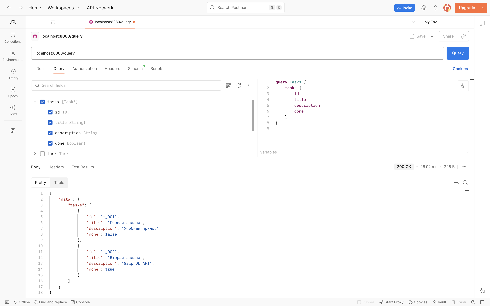
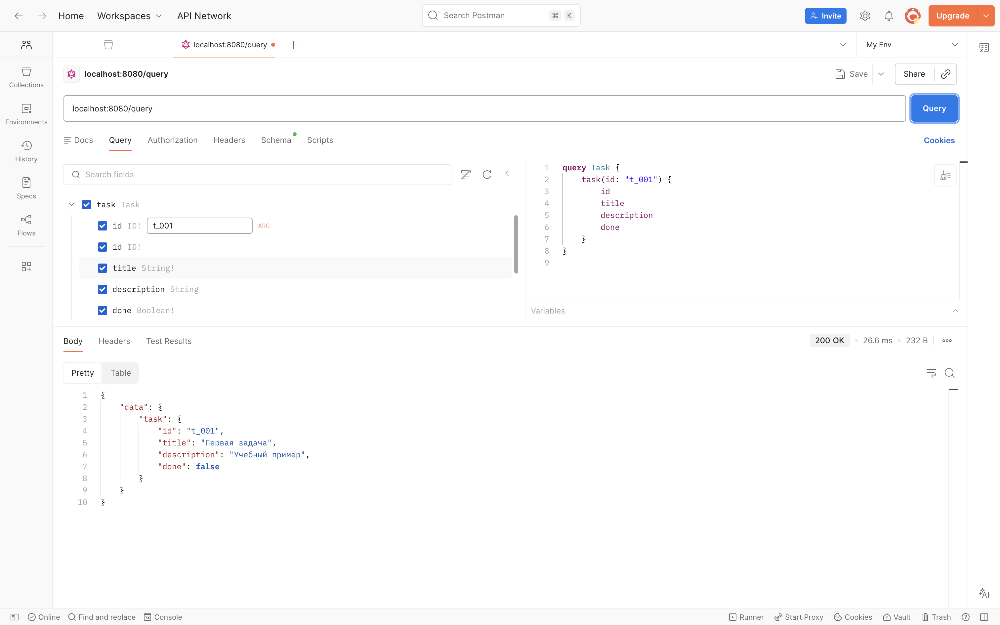
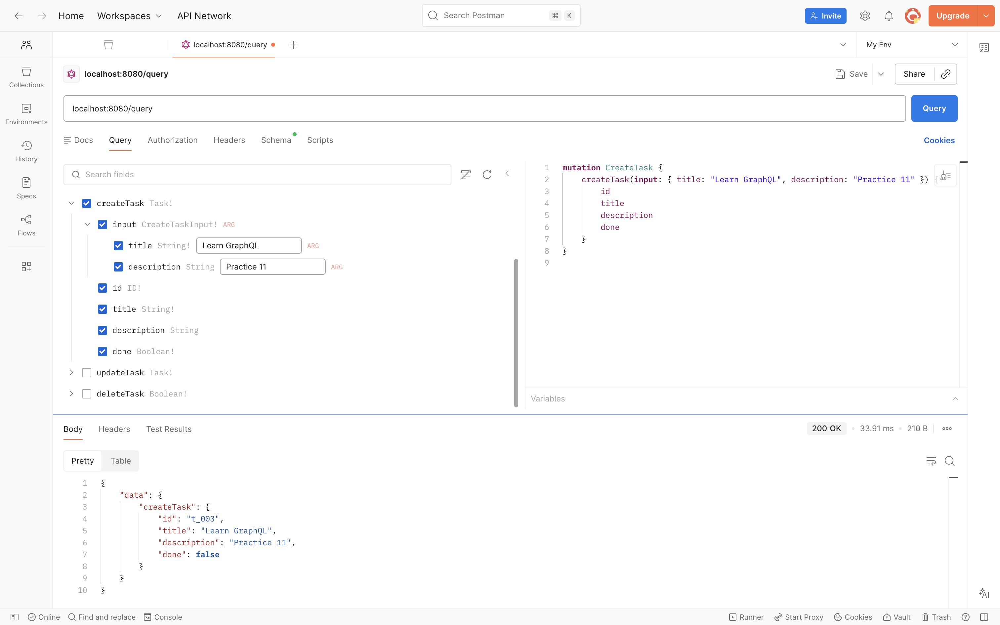
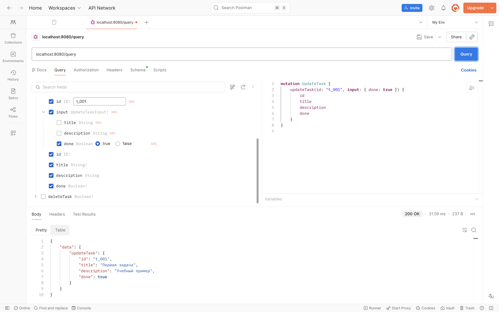
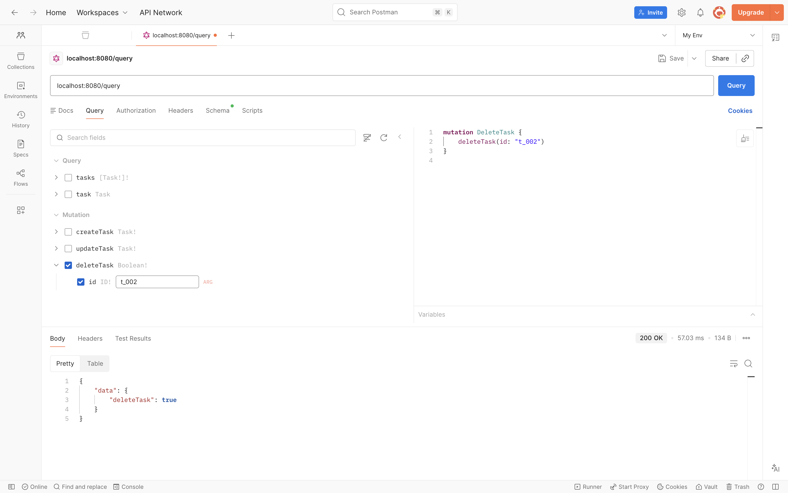

# Коляда Даниил
## Практическая работа №11

### Цель работы

Освоить разработку GraphQL API на языке Go с использованием библиотеки gqlgen, научиться описывать GraphQL-схему, генерировать серверный каркас приложения, реализовывать резолверы для запросов и мутаций, а также тестировать работу API

---

### Шаги

Запрос списка задач


---

Запрос одной задачи по идентификатору


---

Создание задачи


---

Обновление задачи


---

Удаление Задачи


---

### Выводы

Освоили разработку GraphQL API на языке Go с использованием библиотеки gqlgen, научились описывать GraphQL-схему, генерировать серверный каркас приложения, реализовывать резолверы для запросов и мутаций, а также тестировать работу API

---

### Дерево проекта

```
├── README.md
├── go.mod
├── go.sum
├── gqlgen.yml
├── graph
│   ├── generated.go
│   ├── model
│   │   └── models_gen.go
│   ├── resolver.go
│   ├── schema.graphql
│   └── schema.resolvers.go
├── screenshots
│   └── ...
├── server.go
└── services
    └── graphql
        ├── cmd
        │   └── graphql
        │       └── main.go
        ├── handlers
        │   └── handlers.go
        └── store
            └── store.go

10 directories, 18 files
```