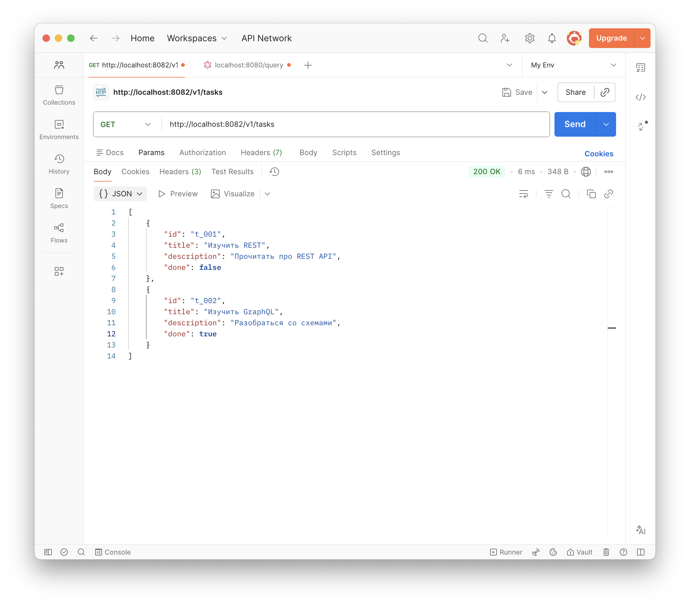
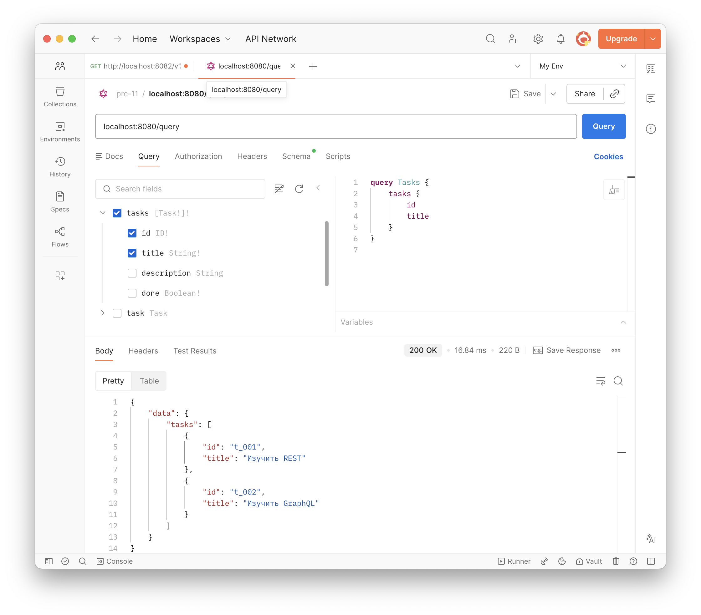

# Коляда Даниил
## Практическая работа №12

### Цель работы

Освоить практическое сравнение REST и GraphQL на примере одного и того же прикладного сценария, научиться реализовывать одинаковый функционал двумя подходами, анализировать различия в структуре запросов и ответов, а также делать обоснованный вывод о целесообразности использования каждого из подходов в backend-разработке

---

### Введение

В рамках работы реализован один и тот же функционал для сущности `Task` двумя способами: REST API и GraphQL API

1. **Список задач** – требуются поля `id`, `title`, `done`
2. **Просмотр одной задачи** – требуются поля `id`, `title`, `description`, `done`
3. **Действие изменения** – создание новой задачи

Оба API используют одинаковую модель данных и in-memory хранилище для чистоты сравнения

---

### Сравнение REST и GraphQL

| Подход   | Запросы                                                                 |
|----------|-------------------------------------------------------------------------|
| REST     | 1. GET /v1/tasks <br> 2. GET /v1/tasks/{id} <br> 3. PATCH /v1/tasks/{id} |
| GraphQL  | 1. query tasks { id title done } <br> 2. query task(id) { ... } <br> 3. mutation updateTask(...) |

**Вывод:** количество запросов одинаково. Преимущество GraphQL в сокращении числа запросов проявляется только в более сложных сценариях. В данном простом CRUD оба подхода требуют трёх вызовов

---

#### Объём данных (over‑fetching)

**Для вывода списка задач** (нужны `id`, `title`):

- **REST** возвращает все поля, включая `description` и `done`  
    включает лишнее поле `description` и `done` (over‑fetching)
    

- **GraphQL** клиент запрашивает только `id`, `title`  
  без лишних данных
  

---

**Оценка**

| Подход   | Размер ответа | Лишние поля |
|----------|---------------|-------------|
| REST     | 348 байт      | да          |
| GraphQL  | 220 байт      | нет         |

---

#### Обработка ошибок

- **REST**:  
  HTTP статус `404 Not Found`, тело:  
  `{"error":"task not found"}`  
  Клиент легко определяет ошибку по статусу и может обработать её отдельно

- **GraphQL**:  
  HTTP статус `200 OK`, тело:  
  `{"errors":[{"message":"task not found"}],"data":null}`  
  Клиенту нужно проверять наличие поля `errors` — менее привычно для REST-разработчика

**Вывод:** REST даёт более явные сигналы об ошибке через HTTP-статусы. GraphQL требует дополнительной логики на клиенте для анализа `errors` и может скрывать фатальные ошибки за кодом 200

---

#### Документирование и тестирование

- **REST**: можно использовать Swagger/OpenAPI. Каждый эндпоинт документируется отдельно. Тестировать через `curl` или Postman очень просто

- **GraphQL**: самодокументируемая схема. Однако документация по бизнес-логике требует дополнительных комментариев. Тестирование через `curl` более громоздкое из-за JSON-обёртки

**Вывод:** для простых API REST удобнее документировать, для сложных иерархических данных GraphQL даёт интерактивную документацию из коробки

---

### Итоговая сравнительная таблица

| Критерий                     | REST                                      | GraphQL                                    |
|------------------------------|-------------------------------------------|--------------------------------------------|
| Количество эндпоинтов        | Много (ресурсо-ориентированные)           | Один (обычно `/query`)                     |
| Выбор возвращаемых полей     | Определяется сервером (фиксированная DTO) | Определяется клиентом (запрос с полями)    |
| Over‑fetching                | Возможен (часто присутствует)             | Практически отсутствует                    |
| Under‑fetching               | Может требовать нескольких запросов       | Минимизирован (один запрос может вложить данные) |
| Количество запросов (для простого CRUD) | Одинаково                         | Одинаково                                  |
| Обработка ошибок             | Через HTTP-статусы (ясно и стандартно)    | Через поле `errors` в теле ответа (HTTP 200) |
| Кэширование                  | Простое (HTTP-кэш, CDN)                   | Сложное (нужен клиентский или специализированный кэш) |
| Простота внедрения           | Высокая (встроено в HTTP)                 | Средняя (нужен генератор схемы, резолверы) |
| Гибкость для клиента         | Низкая (сервер диктует форму ответа)      | Высокая (клиент сам формирует структуру)   |
| Документирование             | OpenAPI/Swagger (отдельные инструменты)   | Самодокументируемая схема + Playground     |

---

### Выводы

- **REST проще** в реализации, кэшировании и отладке. Если клиент всегда использует все поля сущности, over‑fetching не является проблемой. REST остаётся отличным выбором для простых CRUD-сервисов

- **GraphQL даёт точность** — клиент не получает лишнее поле `description`, `done`. Это особенно ценно для мобильных приложений с ограниченным трафиком или сложных фронтендов, где разные компоненты требуют разных наборов полей. Однако его недостатки (сложное кэширование, менее явные ошибки, более крутая кривая обучения) ограничивают применение в небольших проектах

Освоили практическое сравнение REST и GraphQL на примере одного и того же прикладного сценария, научились реализовывать одинаковый функционал двумя подходами, анализировать различия в структуре запросов и ответов, а также делать обоснованный вывод о целесообразности использования каждого из подходов в backend-разработке

---

### Дерево проекта

```
├── README.md
├── go.mod
├── go.sum
├── gqlgen.yml
├── graph
│   ├── generated.go
│   ├── model
│   │   └── models_gen.go
│   ├── resolver.go
│   ├── schema.graphql
│   └── schema.resolvers.go
├── screenshots
│   └── ...
├── server.go
└── services
    └── graphql
        ├── cmd
        │   └── graphql
        │       └── main.go
        ├── handlers
        │   └── handlers.go
        └── store
            └── store.go

10 directories, 18 files
```