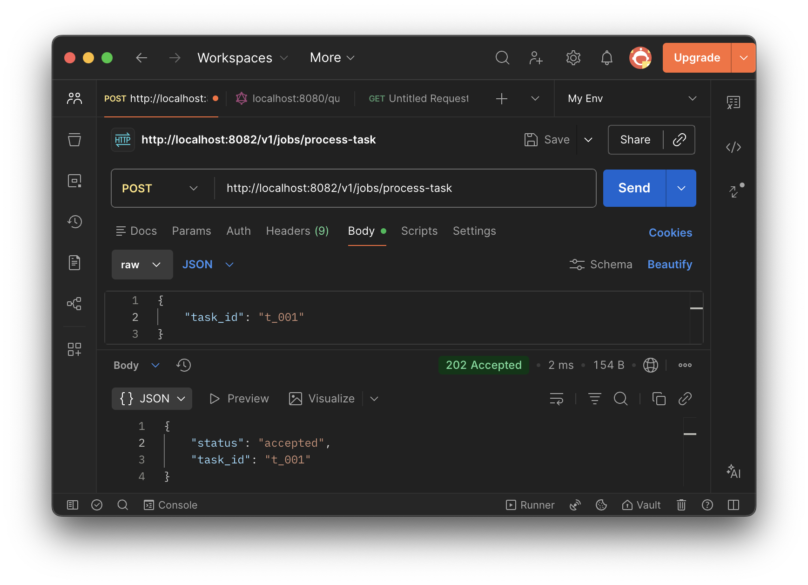
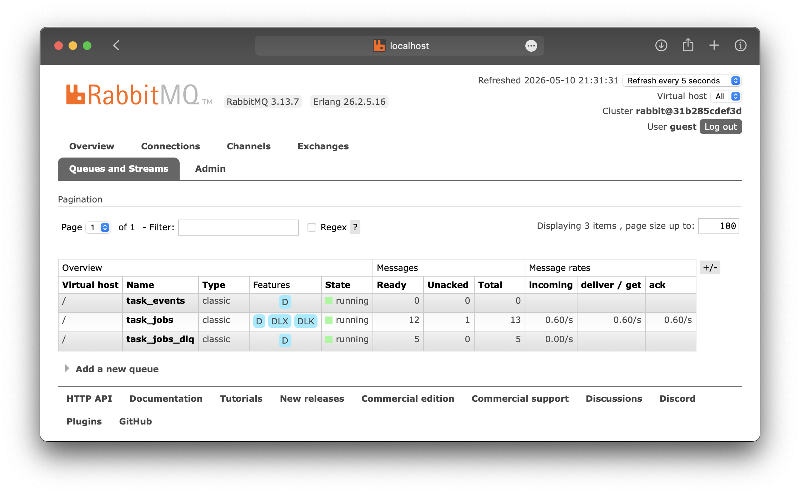
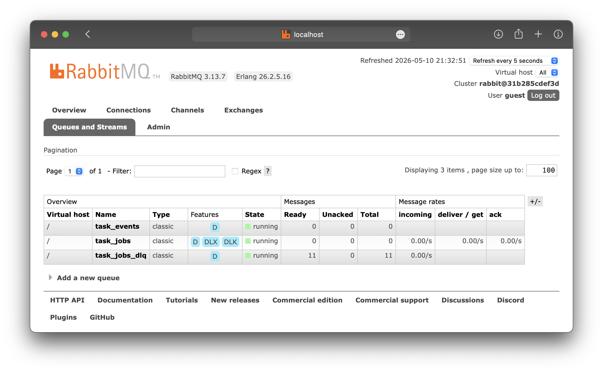

# Коляда Даниил
## Практическая работа №13

### Цель работы

Освоить построение очереди задач по модели producer–consumer с использованием RabbitMQ, научиться организовывать повторные попытки обработки, настраивать очередь проблемных сообщений (DLQ), а также реализовывать базовую идемпотентность обработчика для защиты от повторной обработки одного и того же сообщения. Логика занятия продолжает предыдущую работу с RabbitMQ: теперь вместо простого события рассматривается именно задача, которая может обрабатываться долго, завершаться ошибкой и требовать повторной попытки

---

### Шаги

Запуск RabbitMQ
```
docker compose up -d
```

После запуска management UI доступен по адресу  
`http://localhost:15672`

---

Запуск worker
```
go run ./cmd/worker
```

---

Запуск tasks
```
go run ./cmd/tasks
```

---

Отправляем Success запрос и Failure запрос


---

В worker появляется лог вида
```
2026/05/10 21:26:43 worker started, waiting for jobs...
2026/05/10 21:29:00 success: task_id=t_001 attempt=1
2026/05/10 21:29:46 error: task_id=t_fail attempt=1: simulated failure
2026/05/10 21:29:48 error: task_id=t_fail attempt=2: simulated failure
2026/05/10 21:29:50 error: task_id=t_fail attempt=3: simulated failure
2026/05/10 21:29:50 moved to DLQ: task_id=t_fail
```

---

Интерфейс RabbitMQ



---

### Выводы

Освоили построение очереди задач по модели producer–consumer с использованием RabbitMQ, научились организовывать повторные попытки обработки, настраивать очередь проблемных сообщений (DLQ), а также реализовывать базовую идемпотентность обработчика для защиты от повторной обработки одного и того же сообщения

---

### Дерево проекта

```
├── README.md
├── deploy
│   └── rabbit
│       └── docker-compose.yml
├── go.mod
├── go.sum
├── screenshots
│   └── ...
├── services
│   └── tasks
│       ├── amqpclient
│       │   └── amqpclient.go
│       ├── cmd
│       │   └── tasks
│       │       └── main.go
│       ├── core
│       │   ├── amqp
│       │   │   └── publisher.go
│       │   ├── jobs
│       │   │   └── task_job.go
│       │   ├── network
│       │   │   ├── handler.go
│       │   │   └── job_handler.go
│       │   └── service
│       │       └── task.go
│       ├── events
│       │   └── events.go
│       └── publisher
│           └── publisher.go
└── worker
    ├── cmd
    │   └── worker
    │       └── main.go
    └── core
        ├── amqp
        │   └── setup.go
        ├── consumer
        │   └── processor.go
        └── store
            └── processed.go

23 directories, 20 files
```