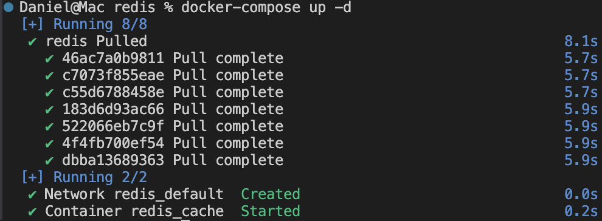
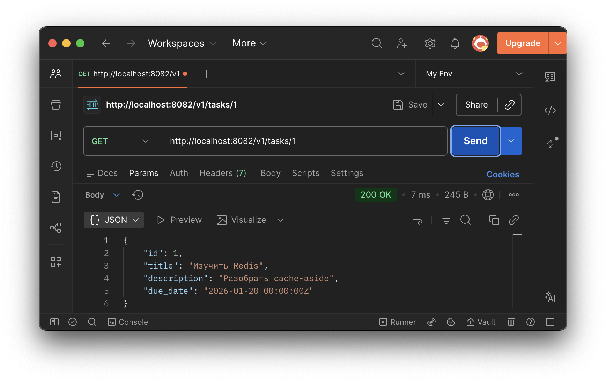
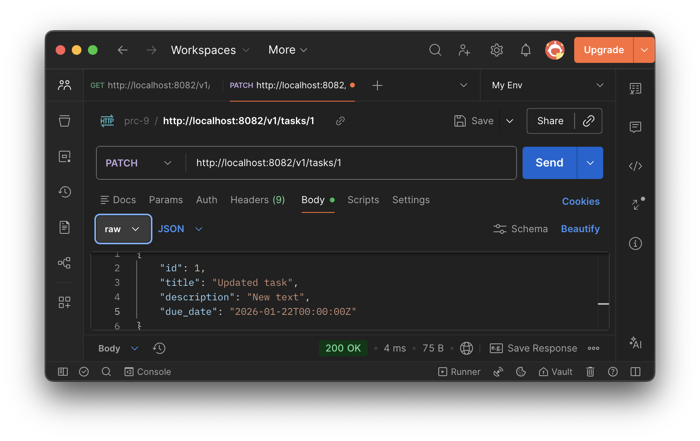
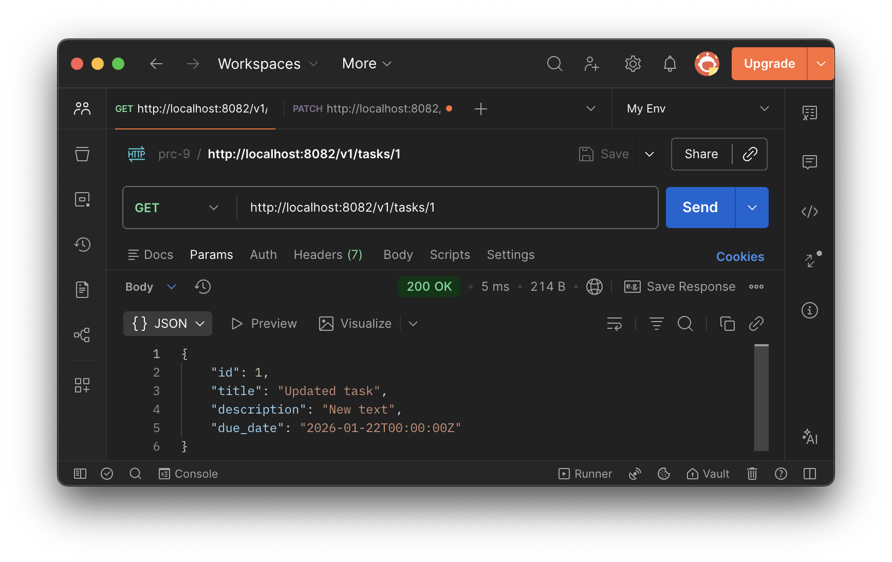
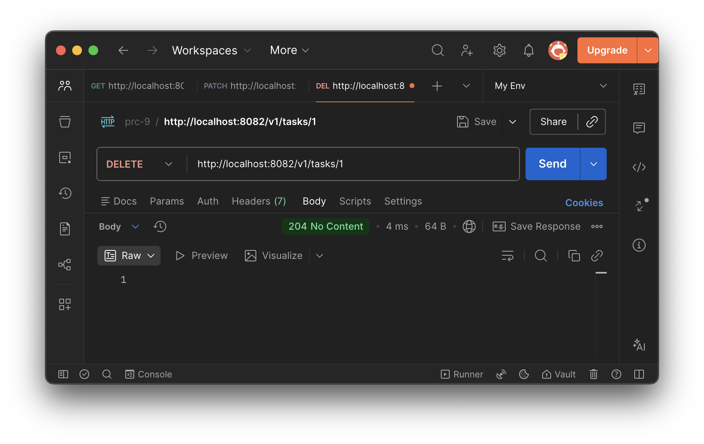
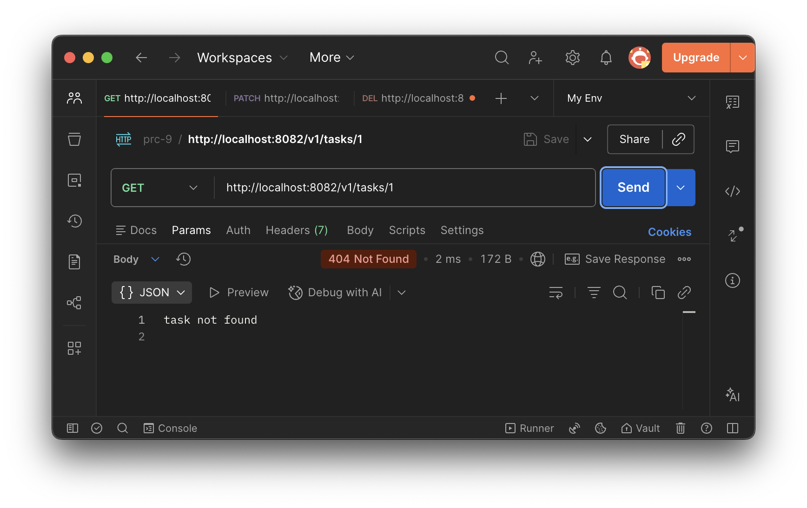
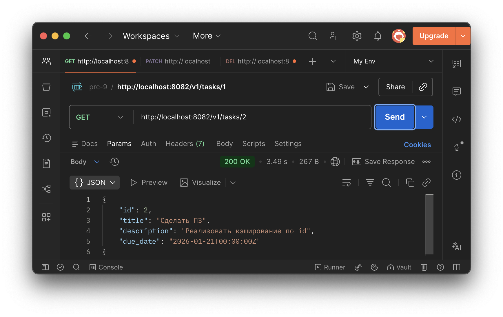
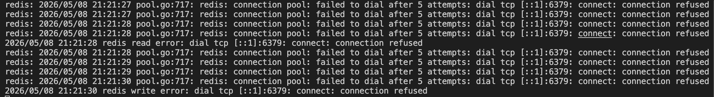

# Коляда Даниил
## Практическая работа №9

### Цель работы

Освоить внедрение распределённого кэша в backend-приложение на Go и реализовать стратегию cache-aside с использованием Redis, корректного TTL, jitter и устойчивого поведения сервиса при недоступности кэша

---

### Шаги

Запустили Redis
```bash
cd deploy\redis
docker compose up -d
```



---

Запустили сервис
```bash
go run ./cmd/server
```

Выполнили первый запрос
```bash
curl http://localhost:8082/v1/tasks/1
```
Запрос не нашел ключ в Redis, идет в репозиторий и получает задачу. Кладет ее в кэш

Затем сразу второй запрос
```bash
curl http://localhost:8082/v1/tasks/1
```

Вернулись данные из Redis


---

Выполнили обновление задачи  
После PATCH ключ tasks:task:1 будет удалён
```bash
curl -X PATCH http://localhost:8082/v1/tasks/1 ^
  -H "Content-Type: application/json" ^
  -d "{
        "id":1,
        "title": "Обновлённая задача",
        "description":"Новый текст",
        "due_date":"2026-01-22T00:00:00Z"
    }"
```



После этого снова выполнили
```bash
curl http://localhost:8082/v1/tasks/1
```

Следующий GET снова пошел в репозиторий и заново заполнил кэш уже свежими данными


---

Выполнили
```bash
curl -X DELETE http://localhost:8082/v1/tasks/1
```



После этого
```bash
curl http://localhost:8082/v1/tasks/1
```

Ожидаемый результат — 404 Not Found


---

Проверка деградации при остановке Redis  
Остановили Redis
```bash
cd deploy\redis
docker compose stop
```

После этого снова выполнили
```bash
curl http://localhost:8082/v1/tasks/2
```

Сервис не упал. Получены данные из репозитория


Записано предупреждение об ошибке Redis


---

### Выводы

Освоили внедрение распределённого кэша в backend-приложение на Go и реализовали стратегию cache-aside с использованием Redis, корректного TTL, jitter и устойчивого поведения сервиса при недоступности кэша

---

### Дерево проекта

```
├── README.md
├── cmd
│   └── server
│       └── main.go
├── deploy
│   └── redis
│       └── docker-compose.yml
├── go.mod
├── go.sum
├── internal
│   ├── cache
│   │   ├── keys.go
│   │   ├── redis.go
│   │   └── ttl.go
│   ├── config
│   │   └── config.go
│   ├── httpapi
│   │   └── handler.go
│   ├── service
│   │   └── task_service.go
│   └── task
│       ├── model.go
│       └── repo.go
└── screenshots
    └── ...

12 directories, 21 files
```